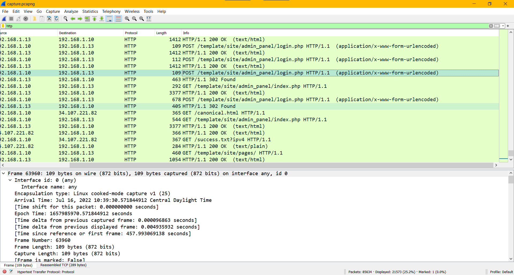
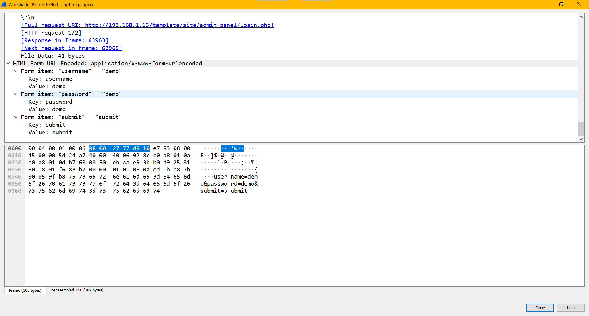

### Challenge Description

What is the admin panel username & password?

Flag Format : BDSEC{username_password}

### Solution

Filtering our [capture.pcapng](attachments/capture.pcapng) file for http traffic we see a number of attempted logins:

We're looking for a login attempt that resulted in the `302 Found` status code:

Examinining the packet we find the following credentials: 

  
Click to see flag
 
  
    BDSEC{demo_demo}

