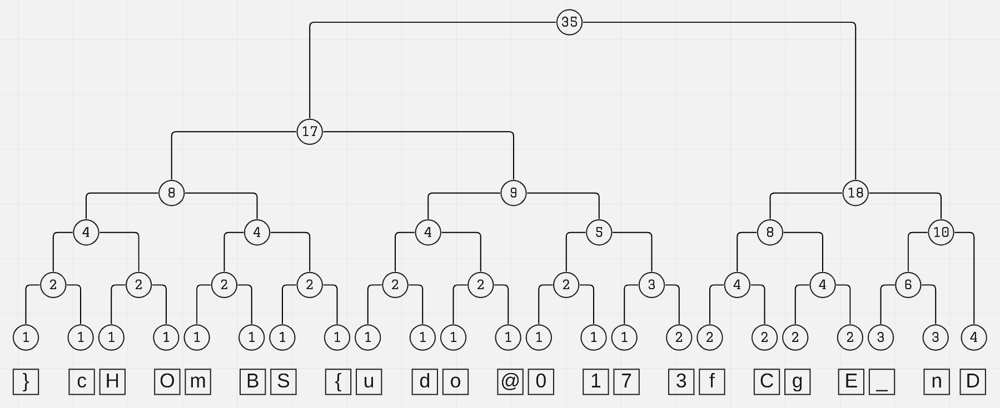

### Challenge Description

One day, Harry Potter was roaming around the Hufflepuff, one of the four Hogwarts houses. Inside one of the room of Hufflepuff, he found a secret numeric message and a graph. Now, he is curious to know what is written in the secret neumeric message. Can you help him to figure it out?

Flag Format : BDSEC{Fl4g_G03s_H3R3}

Attachments

Message_of_Hufflepuff.png

<br />

[msg.txt](attachments/msg.txt)

```
001011110011010111001001110001001000100010000010001011110111001011110100001011000100101101110110101100101001010011101100111011111001000111110111111100000
```

### Solution

