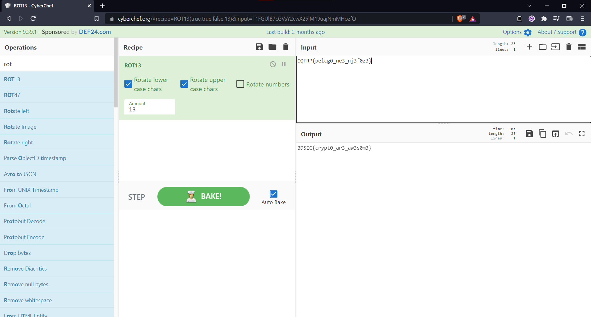

### Challenge Description 

My friend gave me his game username and game id . Can decode game id ?

User : rot

Game ID : OQFRP{pelcg0_ne3_nj3f0z3}

Flag Format : BDSEC{s0m3thing_here}

### Solution

For this challenge we'll use a decoding/encoding web application tool called CyberChef. With CyberChef we can decode the Game ID using the recipe for the ROT13 substitution cipher. 

  
Click to see flag
 
  
    BDSEC{crypt0_ar3_aw3s0m3}

