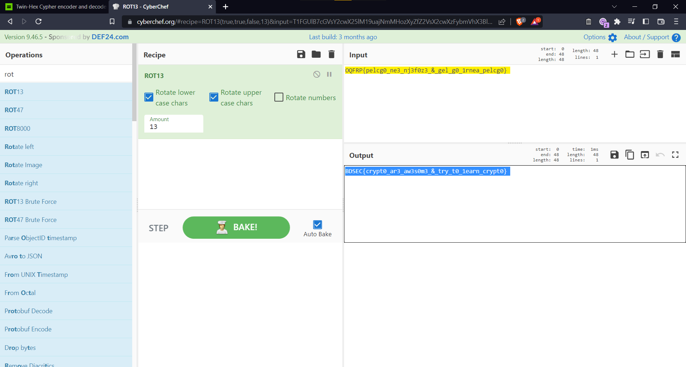

### Challenge Description

My friend gave me his VIP account credential and he said to me decode my password .

User : twin13

password : 3ip2uq3mj5z95oj59s4q654j4q65hv5746oj4o64pz5644pz18f1bm5tx4v35z95oj59s6w0

Flag Format : BDSEC{s0m3thing_here}

### Solution

The password is encoded using the twin-hex cipher to give us the following: 

We can decode `OQFRP{pelcg0_ne3_nj3f0z3_&_gel_g0_1rnea_pelcg0} ` using ROT13 to get our flag.

  
Click to see flag
 
  
    BDSEC{crypt0_ar3_aw3s0m3_&_try_t0_1earn_crypt0} 

