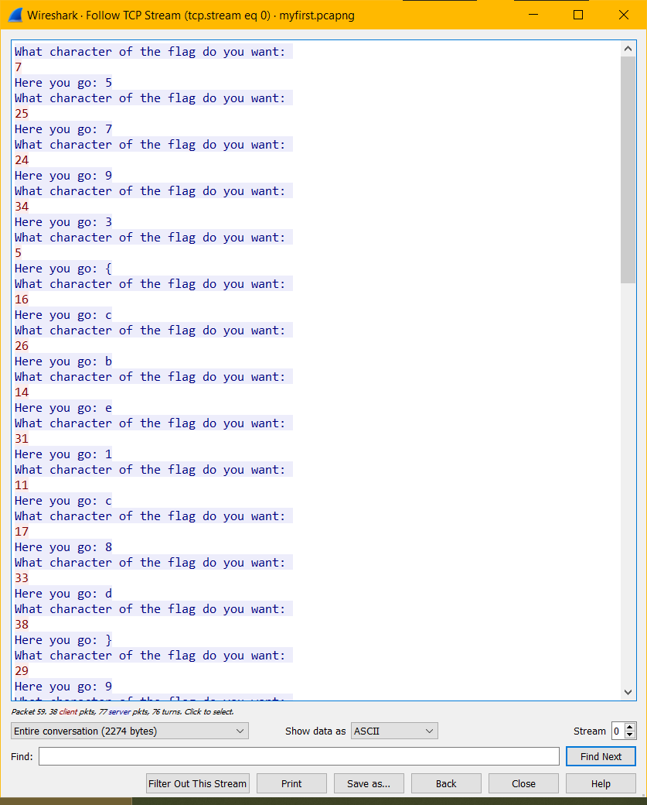

### Challenge Description

We captured some network traffic on our network, can you find out what it is all about?

[myfirst.pcapng](attachments/myfirstpcap/myfirst.pcapng)

### Solution

If we follow the TCP stream of our pcap file we get the following:



Here's the entire dialog:

```
What character of the flag do you want: 
7
Here you go: 5
What character of the flag do you want: 
25
Here you go: 7
What character of the flag do you want: 
24
Here you go: 9
What character of the flag do you want: 
34
Here you go: 3
What character of the flag do you want: 
5
Here you go: {
What character of the flag do you want: 
16
Here you go: c
What character of the flag do you want: 
26
Here you go: b
What character of the flag do you want: 
14
Here you go: e
What character of the flag do you want: 
31
Here you go: 1
What character of the flag do you want: 
11
Here you go: c
What character of the flag do you want: 
17
Here you go: 8
What character of the flag do you want: 
33
Here you go: d
What character of the flag do you want: 
38
Here you go: }
What character of the flag do you want: 
29
Here you go: 9
What character of the flag do you want: 
10
Here you go: f
What character of the flag do you want: 
30
Here you go: 4
What character of the flag do you want: 
32
Here you go: f
What character of the flag do you want: 
21
Here you go: f
What character of the flag do you want: 
36
Here you go: a
What character of the flag do you want: 
23
Here you go: a
What character of the flag do you want: 
12
Here you go: b
What character of the flag do you want: 
18
Here you go: c
What character of the flag do you want: 
6
Here you go: e
What character of the flag do you want: 
4
Here you go: g
What character of the flag do you want: 
9
Here you go: 7
What character of the flag do you want: 
2
Here you go: l
What character of the flag do you want: 
20
Here you go: a
What character of the flag do you want: 
1
Here you go: f
What character of the flag do you want: 
15
Here you go: f
What character of the flag do you want: 
28
Here you go: a
What character of the flag do you want: 
3
Here you go: a
What character of the flag do you want: 
19
Here you go: 5
What character of the flag do you want: 
37
Here you go: 4
What character of the flag do you want: 
35
Here you go: 3
What character of the flag do you want: 
13
Here you go: 1
What character of the flag do you want: 
8
Here you go: 1
What character of the flag do you want: 
27
Here you go: b
What character of the flag do you want: 
22
Here you go: 0
What character of the flag do you want: 

```

<details>
  <summary>Click to see flag</summary> 
  
    flag{e517fcb1efc8c5af0a97bba941fd33a4}

</details>