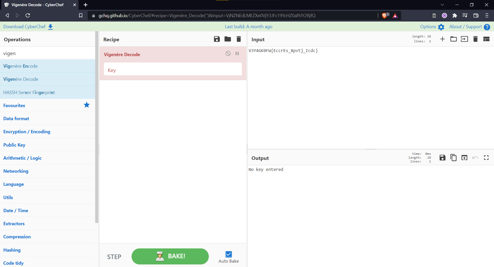
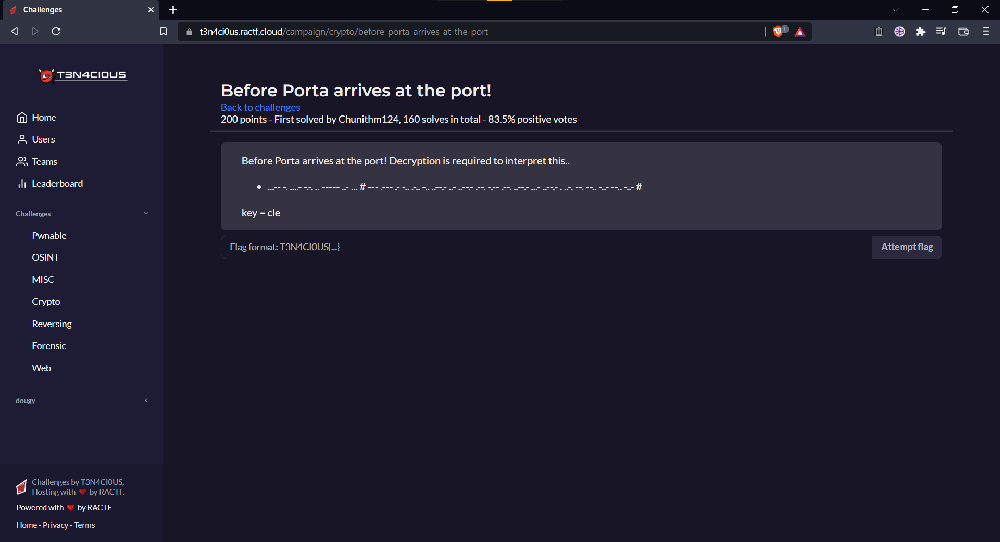
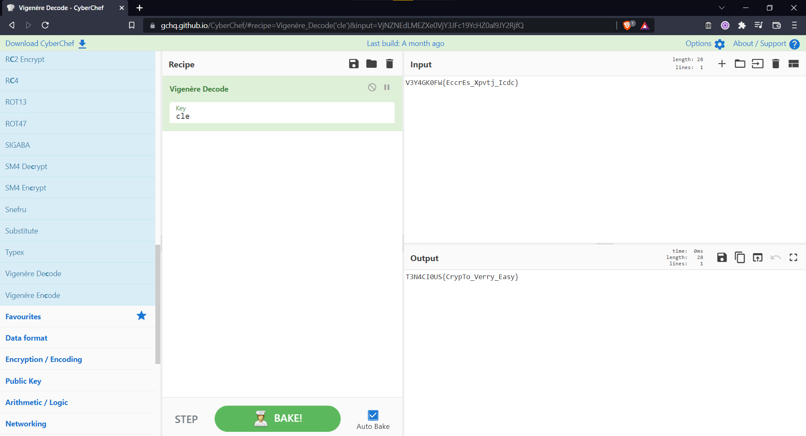

### Challenge Description

French Cipher

V3Y4GK0FW{EccrEs_Xpvtj_Icdc}

### Solution

What is the key we use to decode the ciphertext?

The key is given in [another challenge](before_porta.md):

Using `cle` as our key we can decode the ciphertext as the following:

  
Click to see flag
 
  
    T3N4CI0US{CrypTo_Verry_Easy}

