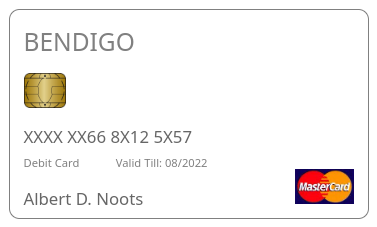

### Challenge Description

Peter: "Welcome to Bendigo, I am Peter. How may I help you today?" Albert: "Hey! I have my bank card here, but I cannot seem to be able to read the credit card numbers on it as some of them are scratched off. I was wondering if you could tell me what they were if I could confirm my identity to you." Peter: "Ohh, unfortunatly I cannot do that. You are going to have to order a new credit card. If you requested one now, it should arrive by 2nd of August. Would you like me to do this for you?" Albert: "Hmm, unfortuately I need it sooner than that. I'll see if I can remember it in the mean time. THANKS PETER..." Peter: "See you!"



The flag is the bankcard number wrapped in UACTF{...}.

Author: Lachlan

### Solution

The obfuscated credit card number:

`XXXX XX66 8X12 5X57`

How do we derive the remaining numbers from what we are given? 

This first six or eight digits of a credit card is the Issuer Identification Number (IIN). We find that all Bendigo bank cards begin with `519244`:


Python implementation of [Luhn's algorithm](https://en.wikipedia.org/wiki/Luhn_algorithm):


```py
def luhn(n):
		r = [int(ch) for ch in str(n)][::-1]
		return (sum(r[0::2]) + sum(sum(divmod(d*2,10)) for d in r[1::2])) % 10 == 0
```

More on Luhn's algorithm here: [PDF](attachments/peter-works-at-bendigo/Handling%20credit%20cards%20-%20IBM%20Documentation.pdf) from https://www.ibm.com/docs/en/order-management-sw/9.3.0?topic=solution-handling-credit-cards

