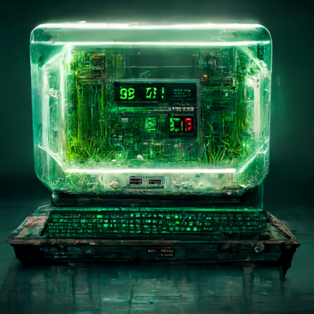

### Challenge Description

*"a computer with green numbers floating around it in a cyberpunk style"*

I came across a new website that claims to keep my flag safe with military-grade encryption. Clearly, this is going to keep my flag safe from anyone who may want it.

https://military-grade-encryption-web.chal.uiuc.tf/

### Solution

