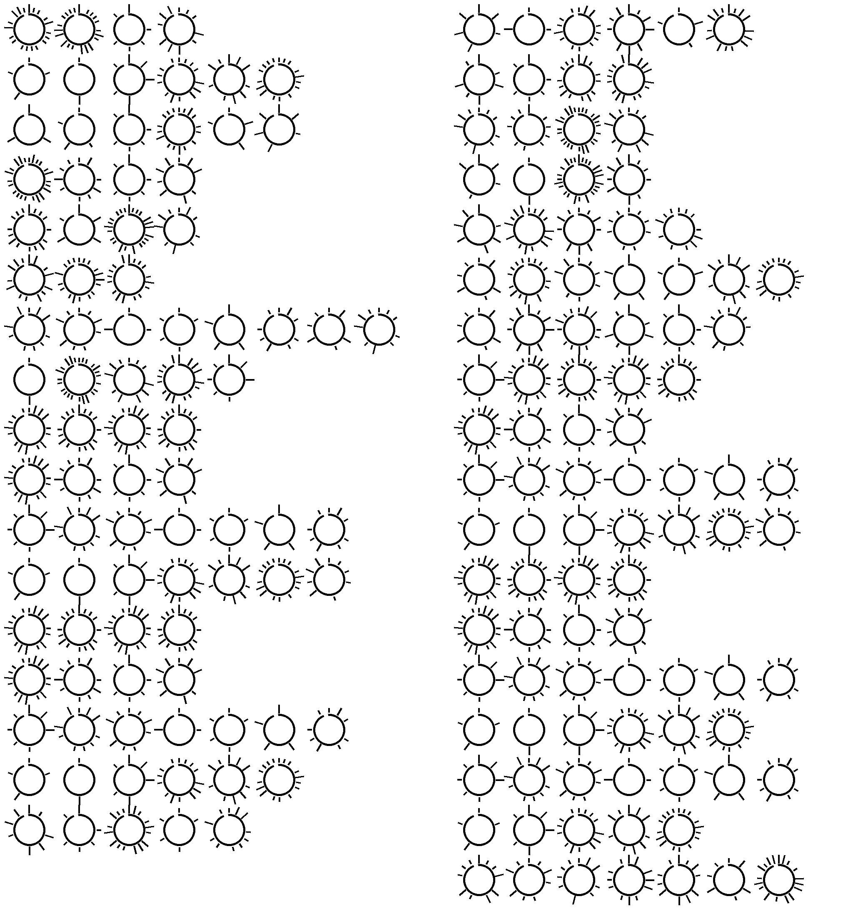

### Challenge Description

During preparations for this year's Christmas, Santa had his elves dig up an ancient archeological site in Lapland.
They found an ancient text written on a tablet from an age long forgotten.
The only problem is that the text is written in a very weird language that no one can understand.
Santa Needs you to decode the ancient text and recover the hidden knowledge that was lost.

Note: The flag for this challenge has a non standard format, it's composed of uppercase alphabetical characters, no spaces.

Attachments: 

By: Gabies

### Solution 

