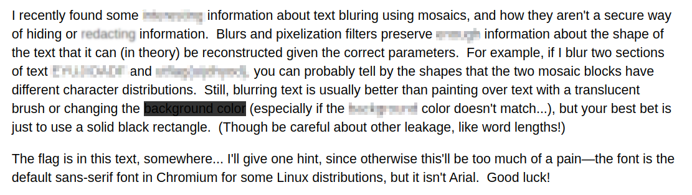
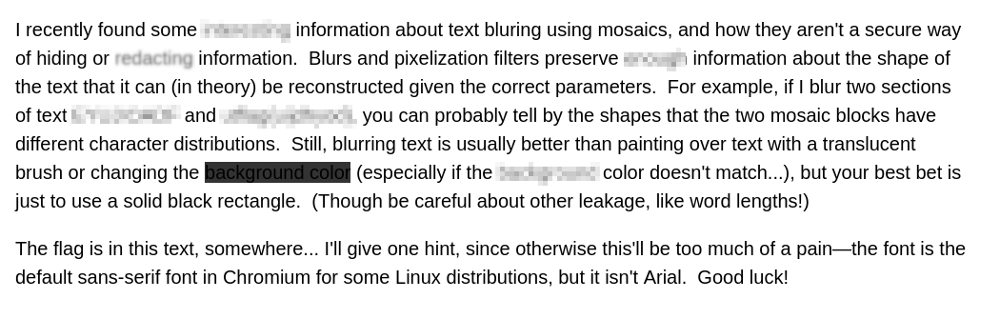
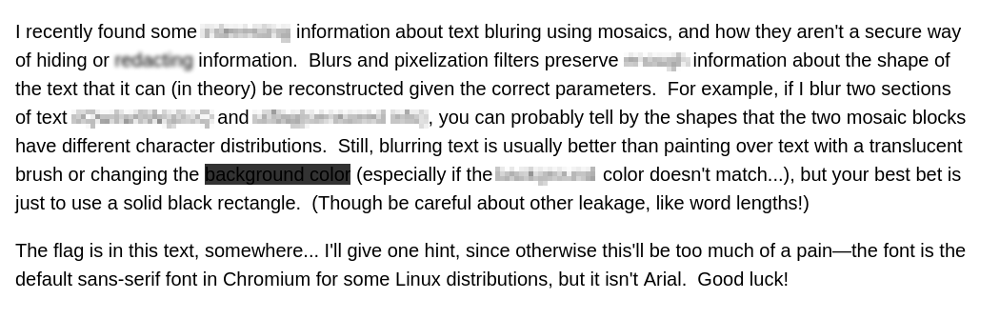

### Challenge Description

Note: there are two accepted flags for Redacted Text, of which you only need to find one.

Well, I recently found out that people actually put in the effort to reverse engineer blured text... Want to try it?

This now has three versions, in order of decreasing difficulty:

redacted.png (the original)
redacted-no-subpixel-aa.png (disabled subpixel anti-aliasing, changed font size)
redacted-aligned.png (integer pixel aligned text, alternate flag)

By Alex 

Attachments: 

redacted:

redacted-no-subpixel-aa

redacted-aligned

    
Hint

    The font size is 20px (15pt) for the new images, and 16pt for the original. The block size is 5px on all images.

### Solution

