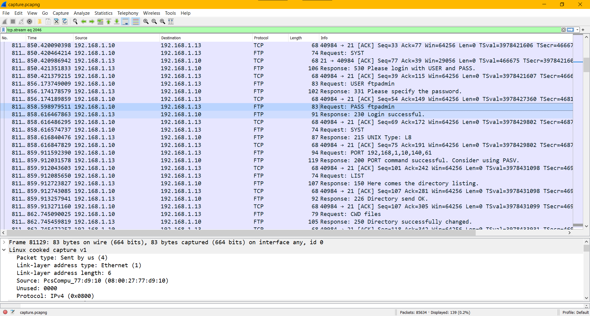
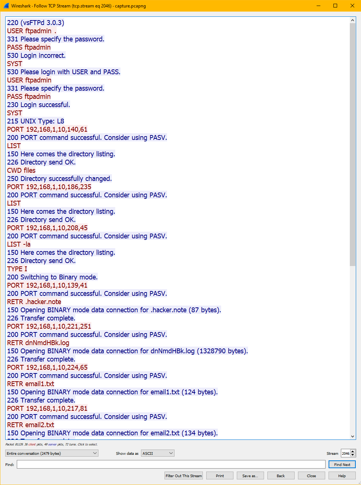

### Challenge Description:

What is the ftp username & password?

Flag Format : BDSEC{username_password}

### Solution:

This is a continuation of the [Victim & Attacker challenge](victim_attacker.md) and uses the same `capture.pcapng` file. See file [here](attachments). 

If we filter for FTP traffic we see a number of unsuccessful login attempts. Eventually we'll see a successful one.



We can follow the TCP stream:



```
220 (vsFTPd 3.0.3)
USER ftpadmin	.
331 Please specify the password.
PASS ftpadmin
530 Login incorrect.
SYST
530 Please login with USER and PASS.
USER ftpadmin
331 Please specify the password.
PASS ftpadmin
230 Login successful.
SYST
215 UNIX Type: L8
PORT 192,168,1,10,140,61
200 PORT command successful. Consider using PASV.
LIST
150 Here comes the directory listing.
226 Directory send OK.
CWD files
250 Directory successfully changed.
PORT 192,168,1,10,186,235
200 PORT command successful. Consider using PASV.
LIST
150 Here comes the directory listing.
226 Directory send OK.
PORT 192,168,1,10,208,45
200 PORT command successful. Consider using PASV.
LIST -la
150 Here comes the directory listing.
226 Directory send OK.
TYPE I
200 Switching to Binary mode.
PORT 192,168,1,10,139,41
200 PORT command successful. Consider using PASV.
RETR .hacker.note
150 Opening BINARY mode data connection for .hacker.note (87 bytes).
226 Transfer complete.
PORT 192,168,1,10,221,251
200 PORT command successful. Consider using PASV.
RETR dnNmdHBk.log
150 Opening BINARY mode data connection for dnNmdHBk.log (1328790 bytes).
226 Transfer complete.
PORT 192,168,1,10,224,65
200 PORT command successful. Consider using PASV.
RETR email1.txt
150 Opening BINARY mode data connection for email1.txt (124 bytes).
226 Transfer complete.
PORT 192,168,1,10,217,81
200 PORT command successful. Consider using PASV.
RETR email2.txt
150 Opening BINARY mode data connection for email2.txt (134 bytes).
226 Transfer complete.
PORT 192,168,1,10,129,233
200 PORT command successful. Consider using PASV.
RETR email3.txt
150 Opening BINARY mode data connection for email3.txt (136 bytes).
226 Transfer complete.
TYPE A
200 Switching to ASCII mode.
PORT 192,168,1,10,156,31
200 PORT command successful. Consider using PASV.
LIST
150 Here comes the directory listing.
226 Directory send OK.
CWD /
250 Directory successfully changed.
PORT 192,168,1,10,200,113
200 PORT command successful. Consider using PASV.
LIST
150 Here comes the directory listing.
226 Directory send OK.
CWD ..
250 Directory successfully changed.
PORT 192,168,1,10,164,31
200 PORT command successful. Consider using PASV.
LIST
150 Here comes the directory listing.
226 Directory send OK.
PORT 192,168,1,10,152,219
200 PORT command successful. Consider using PASV.
LIST -la
150 Here comes the directory listing.
226 Directory send OK.
QUIT
221 Goodbye.
```

We can also filter the above to show only the client's requests (shown in red):

```
USER ftpadmin	.
PASS ftpadmin
SYST
USER ftpadmin
PASS ftpadmin
SYST
PORT 192,168,1,10,140,61
LIST
CWD files
PORT 192,168,1,10,186,235
LIST
PORT 192,168,1,10,208,45
LIST -la
TYPE I
PORT 192,168,1,10,139,41
RETR .hacker.note
PORT 192,168,1,10,221,251
RETR dnNmdHBk.log
PORT 192,168,1,10,224,65
RETR email1.txt
PORT 192,168,1,10,217,81
RETR email2.txt
PORT 192,168,1,10,129,233
RETR email3.txt
TYPE A
PORT 192,168,1,10,156,31
LIST
CWD /
PORT 192,168,1,10,200,113
LIST
CWD ..
PORT 192,168,1,10,164,31
LIST
PORT 192,168,1,10,152,219
LIST -la
QUIT
```

And we have our credentials. 

<details>
  <summary>Click to see flag</summary> 
  
    BDSEC{ftpadmin_ftpadmin}

</details>