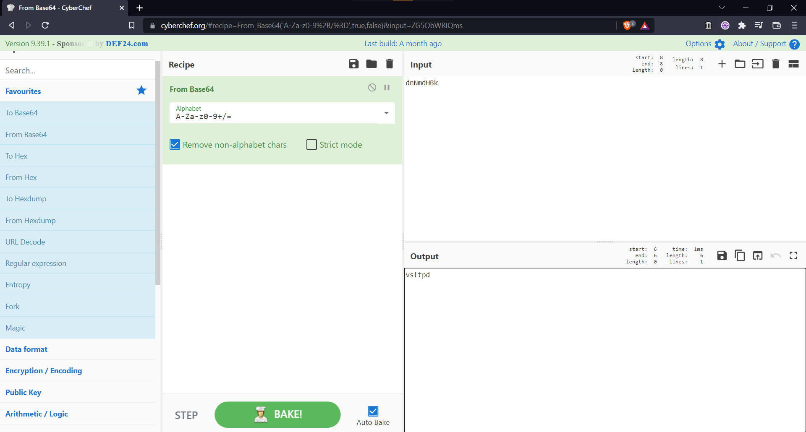

### Challenge Description

What is the log file name?

Flag Format : BDSEC{something.log}

  
Hint
 
  
    Maybe decoding knowledge will help.

 

### Solution

Filtering our [packet capture file](attachments/capture.pcapng) for FTP traffic we see the name of log file. Submitting our flag with the as-is name of `dnNmdHBk.log` gives an incorrect result. 

[CyberChef](https://github.com/gchq/CyberChef) is an encoding/decoding web application that we'll use to decode the log name from Base64 to get the decoded value of `vsftpd`.

  
Click to see flag
 
  
    BDSEC{vsftpd.log}

