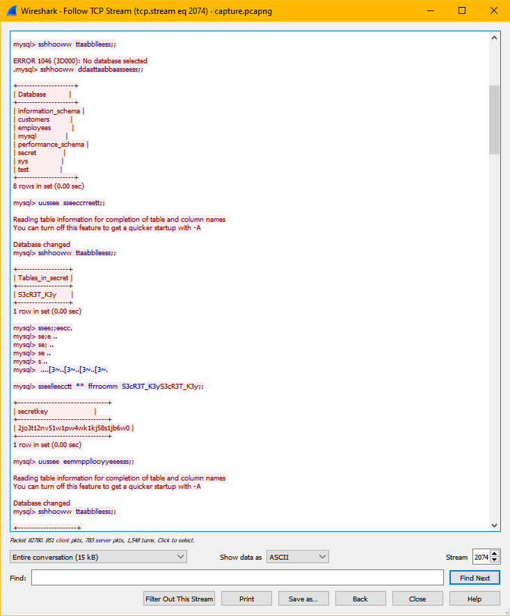

### Challenge Description 

What is the secret key?

Flag Format : BDSEC{secretKey}

### Solution

Looking at the [capture.pcapng](attachments/capture.pcapng) we will find that the attacker was able to access a mySQL server and navigate to the database `secret` to a table containing our secret key:

``` mysql
mysql> show tables;
ERROR 1046 (3D000): No database selected
.mysql> show databases;
+--------------------+
| Database           |
+--------------------+
| information_schema |
| customers          |
| employees          |
| mysql              |
| performance_schema |
| secret             |
| sys                |
| test               |
+--------------------+
8 rows in set (0.00 sec)

mysql> use secret;
Reading table information for completion of table and column names
You can turn off this feature to get a quicker startup with -A

Database changed
mysql> show tables;
+------------------+
| Tables_in_secret |
+------------------+
| S3cR3T_K3y       |
+------------------+
1 row in set (0.00 sec)

mysql> se;ec
mysql> se;e .
mysql> se; .
mysql> se .
mysql> s .
mysql>  ......
mysql> select * from S3cR3T_K3y;
+--------------------------------+
| secretkey                      |
+--------------------------------+
| 2jo3t12nv51w1pw4wk1kj58s1jb6w0 |
+--------------------------------+
1 row in set (0.00 sec)
```



<details>
  <summary>Click to see flag</summary> 
  
    BDSEC{2jo3t12nv51w1pw4wk1kj58s1jb6w0}

</details>