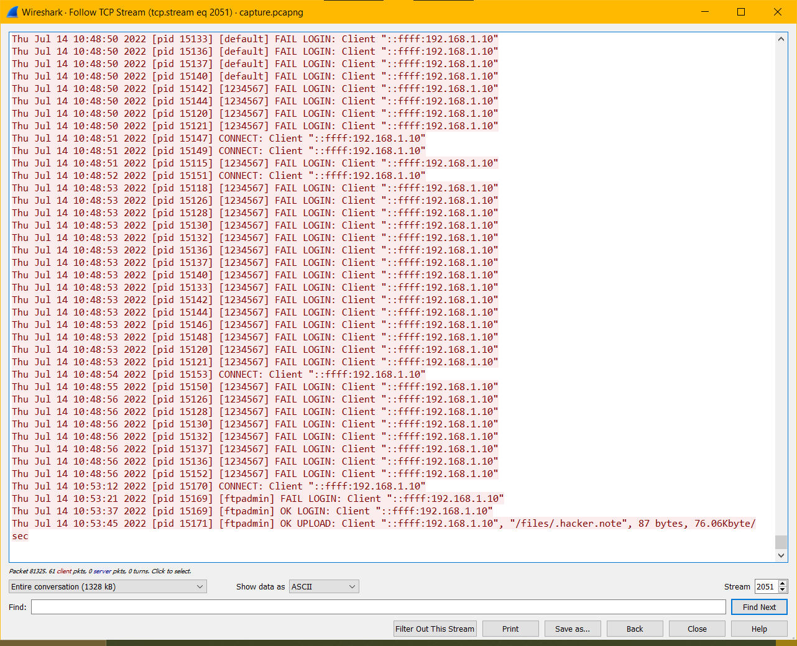

### Challenge Description

What file did the attacker uploaded to the ftp server? [with location]

Flag Format : BDSEC{/location/file_name}

### Solution

From our [capture.pcapng](attachments/capture.pcapng) file we see that `ftpadmin` has uploaded something. 

  
Click to see flag
 
  
    BDSEC{/files/.hacker.note}

