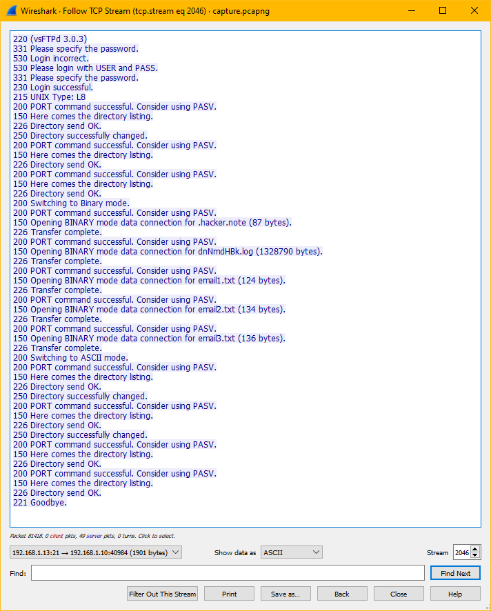

### Challenge Description:

NSTechvally is an multinational hosting & cloud service providing company. Recently we have detected some unusal activity to the server. An attacker got access to our server. And we recently found out that the developer did some mistakes developing our website. We have captured the network traffic. Help us to find out how the attacker compromised our server.

Note: this challenge has an attached [capture.pcapng](attachments/capture.pcapng) that is used for all of the other networking challenges.

What is the server ip & the attacker ip?

Flag Format: BDSEC{0.0.0.0_127.0.0.1}

### Solution:

Looking at our [capture.pcapng](attachments/capture.pcapng) file we can filter by FTP traffic noticing a number of login attempts to a FTP server. We can follow the TCP and filter to show the server's responses to the attacker. 

We have the address of the server and the attacker.

  
Click to see flag
 
  
    BDSEC{192.168.1.13_192.168.1.10}

