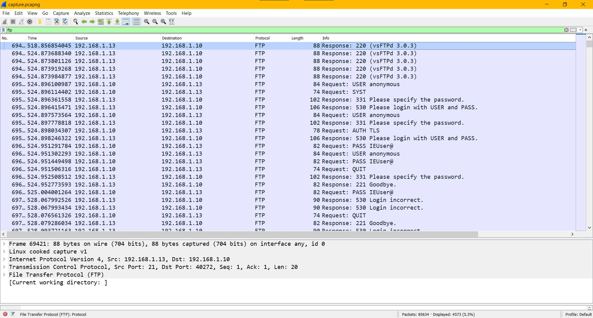

### Challenge Description

What ftp & version the server is using?

Flag Format : BDSEC{ftp_0.0.0}

### Solution

We can filter for FTP traffic in our [capture.pcapng](attachments/capture.pcapng) file to get the FTP server and version number. 

`vsftpd` is the default FTP daemon for some Linux distrubutions:

https://en.wikipedia.org/wiki/Comparison_of_FTP_server_software_packages

  
Click to see flag
 
  
    BDSEC{vsFTPd_3.0.3}

