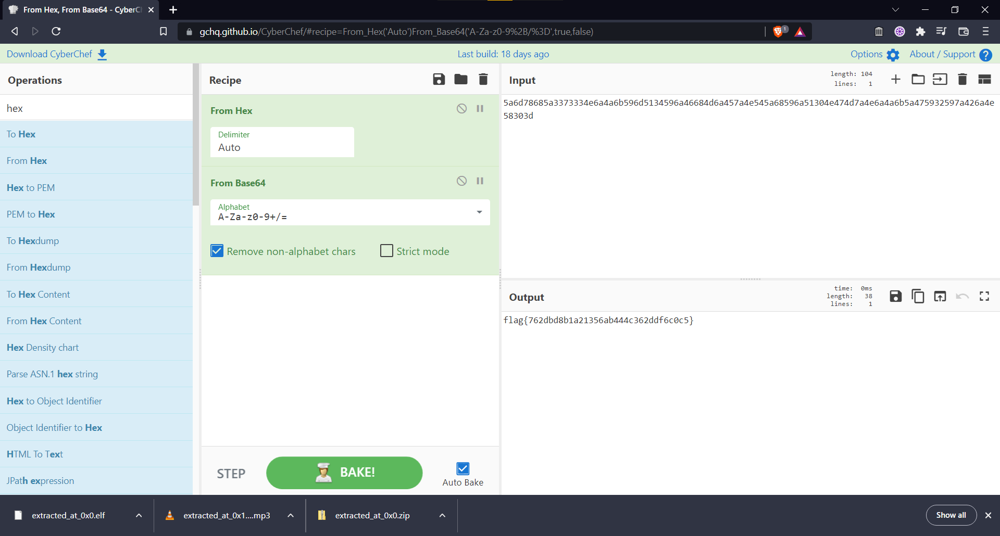

### Challenge Descripion

Sometimes you can see how data is encoded. Can you get the flag from this data?
`5a6d78685a3373334e6a4a6b596d5134596a46684d6a457a4e545a68596a51304e474d7a4e6a4a6b5a475932597a426a4e58303d`

### Solution

We're going to use CyberChef to decode our data from hexadecimal to get the following Base64 value:

`ZmxhZ3s3NjJkYmQ4YjFhMjEzNTZhYjQ0NGMzNjJkZGY2YzBjNX0=`

  
Click to see flag
 
  
    flag{762dbd8b1a21356ab444c362ddf6c0c5}

