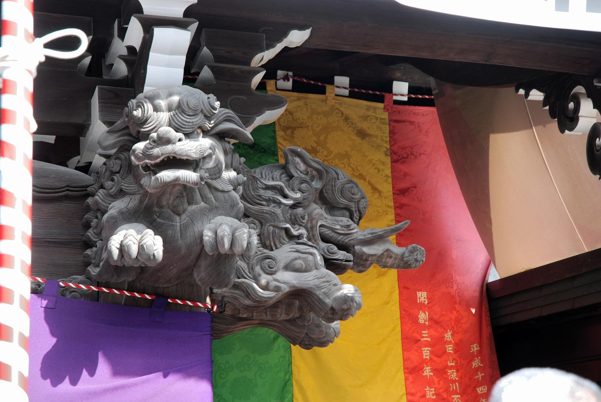
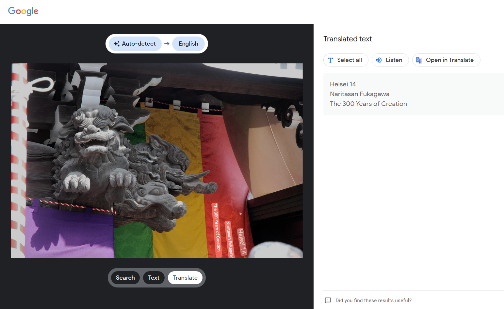
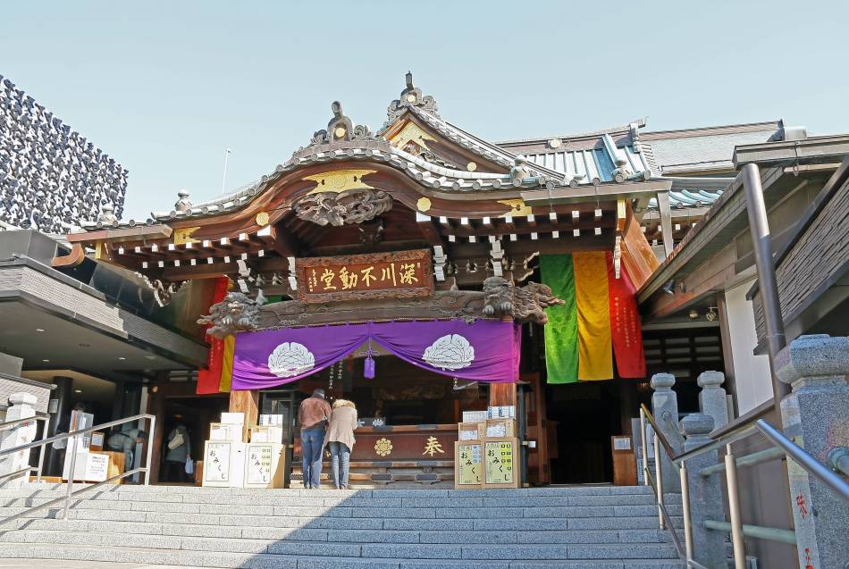

### Challenge Description

I took a picture while traveling in Japan
I keep thinking about this place and I want to know where it is. Tell me where it is

Please mark the space with _

T3N4CI0US{District_Neighborhood}



### Solution

Immediately we notice the ornaments, the text, and the banners (possibly to indicate some sort-of event or celebration). 

We can use a reverse image search and the text from the banners can be translated:

```
Heisei 14
Naritasan Fukagawa
The 300 Years of Creation
``` 


What can we find by searching for `Naritasan Fukagawa`?


Image from https://www.gotokyo.org/en/destinations/eastern-tokyo/fukagawa/index.html

From the above image we notice identical flags and pillar decorations. 

More information about the temple and the area can be found here:

http://fukagawafudou.jugem.jp/

https://www.japan-experience.com/all-about-japan/tokyo/attractions-excursions/fukagawa

https://en.wikipedia.org/wiki/Fukagawa,_Tokyo


<details>
  <summary>Click to see flag</summary> 
  
    T3N4CI0US{Koto_Fukagawa}

</details>